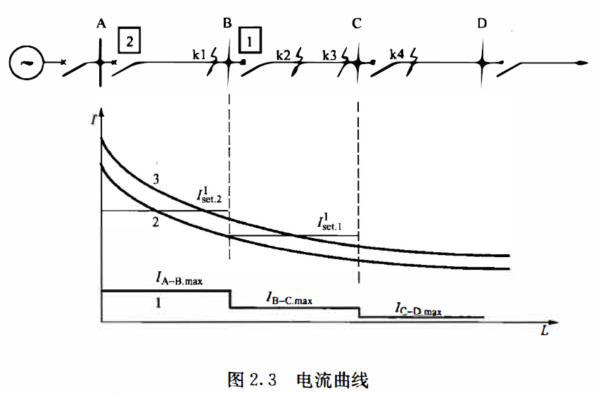
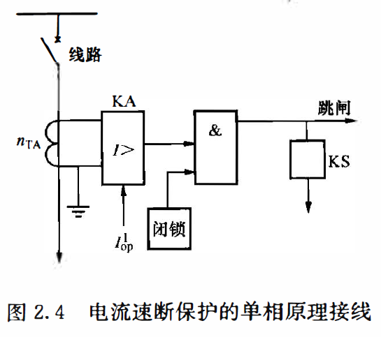
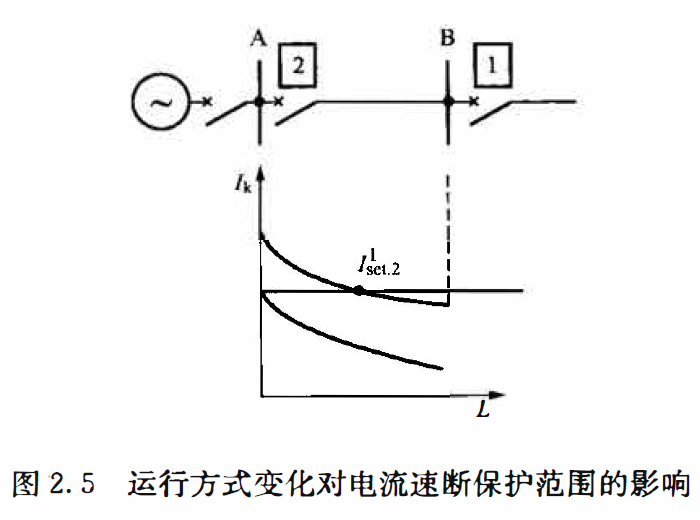
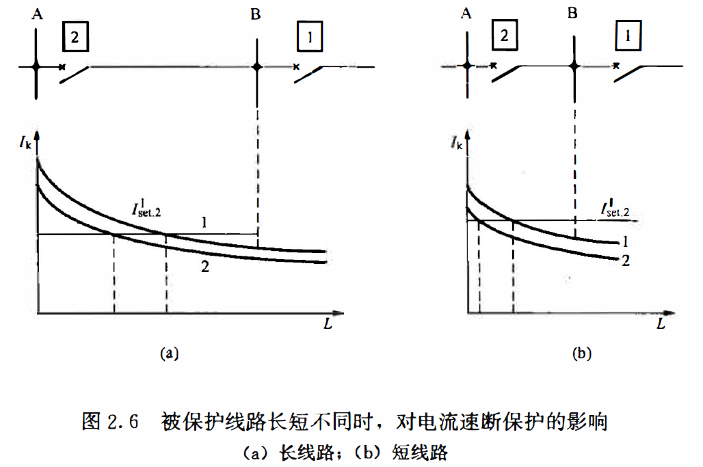
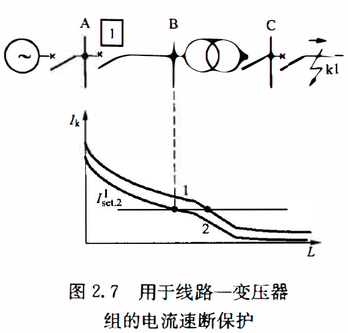
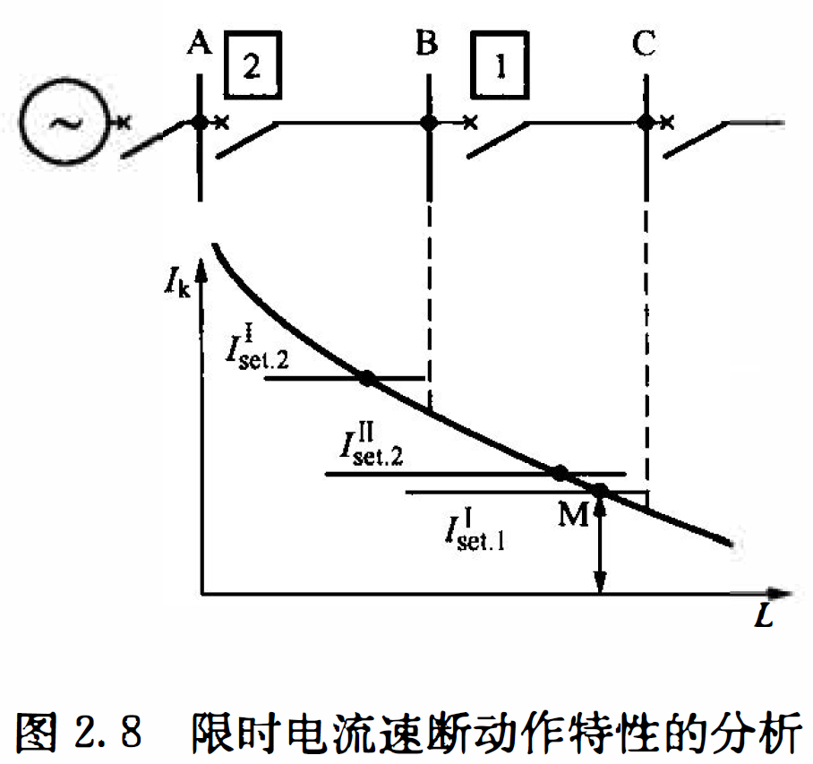
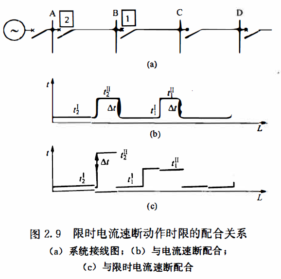
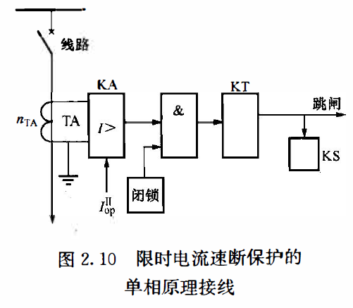

### 电力系统正常运行的等式约束条件：

$$
\begin{array}{l}
\sum P_{Gi}-\sum P_{Lj}-\sum \Delta P_S=0\\
\sum Q_{Gi}-\sum Q_{Lj}-\sum \Delta Q_S=0
\end{array}
$$

式中：$\sum P_{Gi}、\sum Q_{Gi}$     ——分别为i个发电机或其他电源设备发出的有功和无功功率；

​			$\sum P_{Lj}、\sum Q_{Lj}$     ——分别为j个负荷使用的有功功率和无功功率；

​			$\sum \Delta P_S、\sum \Delta Q_S$——分别为电力系统中各种有功功率和无功功率损耗。

### 电力系统正常运行的等式约束条件：

$$
\begin{array}{l}
S_k\leq S_{k.max}\\
U_{i.min}\leq U_i \leq U_{i.max}\\
I_{ij}\leq I_{ij.max}\\
f_{min}\leq f \leq f_{max}
\end{array}
$$

式中：$S_k、S_{k.max}$               —— 分别为发电机、变压器或用电设备的功率及其上限；
			$U_i、U_{i.max}、U_{i.min}$—— 分别为母线电压及其上、下限；
			$I_{ij}、I_{ij.max}$b            —— 分别为输、配电线路中的电流及其上限；
			$f、f_{max}、f_{min}$        —— 分别为系统频率及其上、下限。

### 继电保护的四个基本要求：

- 可靠性：即不拒动、不误动；

- 选择性：是指保护装置动作时，在可能最小的区间内将故障从电力系统中断开，最大限度地保证系统中无故障部分仍能继续安全运行。
  - 它包含两种意思：其一是只应由装在故障元件上的保护装置动作切除故障；
  - 其二是要力争相邻元件的保护装置对它起后备保护作用。

- 速动性：速动性是指尽可能快地切除故障，以减少设备及用户在大短路电流、低电压下运行的时间，降低设备的损坏程度，提高电力系统并列运行的稳定性。
  
- 灵敏性：是指对于其保护范围内发生故障或不正常运行状态的反应能力。

### 继电特性

- 无论启动和返回，继电器的动作都是明确干脆的，不可能停留在某个中间位置，这种特性称之为继电特性；
- 返回系统：返回电流与启动电流的比值称为继电器的返回系统；
  - 公式：$K_{re}=\frac{I_{re}}{I_{op}}$
  - 过量动作的继电器的返回系统恒小于1（0.85~0.9）；
  - 欠量动作的继电器的返回系统恒大于1；

### 单侧电源网络相间短路时电流量值特征

- 110kV及以上电压等级的电网，主要承担输电任务，形成多电源环网；

  - 采用中性点直接接地方式；
  - 其主保护一般由纵联保护担任；

- 110kV以下电压等级的电网，主要承担供、配电任务；

  - 中性点采用非直接接地方式（发生单相接地后为保证继续供电）；
  - 通常采用双电源互为备用，正常时单侧电源供电的运行方式。
  - 其主保护一般由阶段式动作特性的电流保护担任。

- 功率因数角：

  - 定义：负荷电流与供电电压之间的相位角就是通常所说的功率因数角，，一般小于30°；

- 当供电网络中任意点发生三相和两相短路时，流过短路点与电源间线路中的短路电流包括短路工频周期分量、暂态高频分量和衰减直流分量其短路工频周期分量近似计算式为

  $I_k=\frac{E_\varphi}{Z_\varphi}=K_\varphi \frac{E_\varphi}{Z_s+Z_k}$

  式中
  $E_\varphi$——系统等效电源的相电动势；
  $Z_k$——短路点至保护安装处之间的阻抗；
  $Z_S$——保护安装处(测量点)到系统等效电源之间的阻抗；
  $K_\varphi$——短路类型系数， 三相短路取1, 两相短路取$\frac{\sqrt{3}}{2}$ 。

- 系统最大运行方式：总可以找到这样的系统运行方式， 在相同地点发生相同类型的短路时流过保护安装处的电流最大， 对继电保护而言称为系统最大运行方式， 对应的系统等值阻抗最小，$Z_s=Z_{s. min}$。
- 系统最小运行方式：也可以找到这样的系统运行方式， 在相同地点
  发生相同类型的短路时流过保护安装处的电流最小， 对继电保护而言称为系统最小运行方
  式， 对应的系统等值阻抗最大，$Z_s=Z_{s. max}$。
- 取最大运行方式下三相短路和最小运行方式下两相短路， 经计算后绘出流经保护安装处的短路电流随短路点距离变化的两条曲线，在系统所有的运行方式下， 在相同地点发生不同类型的短路时流过保护安装处的电流都介于这两个短路电流值之间。

## 电流速断保护（电流I段保护）

### 1、工作原理

- 定义：对于反应于短路电流幅值增大而瞬时动作的电流保护，称为电流速断保护。
- 为了保证其选择性， 一般只能保护线路的一部分；

### 2、电流速断保护的整定计算原则

#### （1）动作电流整定方法：

- 方法1：按躲开下一条线路出口处短路的条件整定
- 方法2：在个别情况下，当快速切除故障是首要条件时，就采用无选择性的速断保护，而以自动重合闸来纠正这种无选择性动作。
- 对反应电流升高而动作的电流速断保护而言，能使该保护装置启动的最小电流值称为保
  护装置的整定电流，以$I_{set}$表示，用电力系统一次侧的参数表示;

##### 一次动作电流计算：

$$
I^I_{set.1}=K^I_{rel}I_{kc.max}=\frac{E_{\varphi}}{Z_{s.min}+Z_{B-C}}
$$

式中：$K^I_{rel}=1.2-1.3$,为可靠系统图

##### 二次动作电流计算：

$$
I^I_{OP}=\frac{I^I_{rel}}{n_{TA}}K_{con}
$$

式中：$n_{TA}$——电流互感器的变比如

​			$K_{con}$——电流互感器的接线系数，其值与电流互感器的接线方式有关，当电流互感器的二次侧为三相星形或两相星形连接时其值为1；当二次侧为三角形接线时，其值为$\sqrt{3}$

- 速断保护的动作时间取决于继电器本身固有的动作时间， 一般小于10ms
- 考虑到躲过线路中避雷器的放电时间为40~60ms, 一般加装一个动作时间为60~80ms 的保护出口中
  间继电器

#### (2)保护范围的校验

- 在已知保护的动作电流后， 大于一次动作电流的短路电流对应的短路点区域，就是保护范围；

- 最小的保护范围在系统最小运行方式下两相短路时出现；

- 校验保护的最小范围要求大于被保护线路全长的15%～ 20%

- 保护的最小范围计算式为：
  $$
  I^I_{set}=I_{kLmin}=\frac{\sqrt{3}}{2}\frac{E_{\varphi}}{Z_{s.max}+z_lL_{min}}
  $$
  式中 $L_{min}$ ——电流速断保护的最小保护范围长度；
  		      $z_l$ ——线路单位长度的正序阻抗。

### 3. 电流速断保护的构成

- 电流速断保护的单相原理接线如图2.4 所示。过电流继电器接千电流互感器TA 的二次侧， 当流过它的电流大于它的动作电流I占后， 比较环节KA 有输出。在某些特殊情况下需要闭锁跳闸回路，设置闭锁环节。闭锁环节在保护不需要闭锁时输出为1, 在保护需要闭锁
  时输出为0。当比较环节KA 有输出并且不被闭锁时，与门有输出， 发出跳闸命令的同时，启动信号回路的信号继电器KS。

### 4.电流速断保护的主要优、缺点

- 优点：简单可靠、动作迅速；
- 缺点：不可能保护线路的全长，并且保护范围直接受运行方式变化的影响；

#### 适用范围：

1、当系统运行方式变化很大，速断保护就可能没有保护范围，因而不能采用。例如图2.5所示为系统运行方式变化很大的情况，当保护2电流速断按最大运行方式下保护选择性的条件整定以后，在最小运行方式下就没有保护范围；

2、被保证线路的长度很短时，速断保护就可能没有保护范围，因而不能采用

​		如图2.6所示为被保证线路长短不同的情况，当线路较长时，其始端和末端短路电流的差别较大，因而短路电流变化曲线比较陡，保护范围比较大，如图2.6 (a)所示。而当线路短时，由于短路电流曲线变化平缓，速断保护的整定值在考虑了可靠系数以后，其保护范围将很小甚至等于零，如图2.6（b）所示。

3、但在个别情况下，有选择性的电流速断也可以保护线路的全长；

  例如当电网的终端线路上采用线路—变压器组的接线方式，如图2. 7所示时，由千线路和变压器可以看成是一个元件，因此速断保护就可以按照躲开变压器低压侧线路出口处kl点的短路来整定，由于变压器的阻抗一般较大，，因此kl点的短路电流就大为减小？，这样整定之后，电流速断就可以保护线路A-B的全长，并能保护变压器的一部分。

## 限时电流速断保护（电流II段保护）

### 1. 工作原理

由于有选择性的电流速断保护不能保护本线路的全长，因此可考虑增加一段带时限动作的保护，用来切除本线路上速断保护范围以外的故障，同时也能作为速断保护的后备，这就是限时电流速断保护。

- 对这个保护的要求：
  - 首先是在任何情况下能保护本线路的全长，并且具有足够的灵敏性；
  - 其次是在满足上述要求的前提下，力求具有最小的动作时限；
  - 在下级线路短路时，保证下级保护优先切除故障，满足选择性要求。
- 具体方法：		
  - 它的保护范围要延伸到下级线路中去，且不超过下级线路速断保护的范围
  - 而动作时限则比下级线路的速断保护高出一个时间阶梯$\Delta t$，0.3~0.5s之间， 通常多取为0.5s

### 2.限时电流速断保护的整定

#### (1)启动电流的整定

公式为：
$$
I^{II}_{set.2}=K^{II}_{rel}I^I_{set.1}
$$
式中           $I^{II}_{set.2}$——保护2的限时电流速断保护（II段保护）的整定值；

​                  $I^{I}_{set.1}$——保护1的电流速断保护（I段保护）的整定值；

​                  $K^{II}_{rel}$——可靠性配合系数， 一般取为1.1~1.2；

#### (2)动作时限的选择

- 限时速断的动作时限$t^{II}_2$ , 应选择得比下级线路速断保护的动作时限$t^I_1$高出一个时间阶梯$\Delta t$， 即
  $$
  t^{II}_2=t^I_1+\Delta t
  $$

- 对于通常采用的断路器和间接作用于断路器的二次式继电器而言，$\Delta t$的数值在0.3~0.5s之间， 通常多取为0.5s

- 当线路上装设了**电流速断**和**限时电流速断保护**以后，它们的**联合工作**就可以保证全线路范围内的故障都能够在0.5s的时间内予以切除，在一般情况下都能够满足速动性的要求。具有这种快速切除全线路各种故障能力的保护称为该线路的“**主保护**”。

### 3.保护装置灵敏性的校验

- 定义：为了能够保护本线路的全长，限时电流速断保护必须在系统最小运行方式下，线路末端发生两相短路时，具有足够的反应能力，这个能力通常用灵敏系数$K_{sen}$​来衡量。对反应于数值上升而动作的过量保护装置，灵敏系数的含义是
  $$
  K_{sen}=\frac{保护范围内发生金属性短路时故障参数的计算值}{保护装置的动作参数值}
  $$

- 故障参数（如电流，电压等）的计算值，应根据实际情况合理采用最不利于保护动作的系统运行方式和故障类型来选定，但不必考虑可能性很小的特殊情况。

- 如图2.9，对保护2的限时电流速断而言，即应采取系统最小运行方式下线路A-B末端发生两相短路时短路电流作为故障参数的计算值。设此电流为$I_{k.B.min}$ , 则灵敏系数为

$$
K_{sen}=\frac{I_{k.B.min}}{I^{II}_{set.2}}
$$

- 为了保证在线路末端短路时，保护装置一定能够动作，要求$K_{sen} \geq$1.3~1.5 。

- 当灵敏系数不能满足要求时,通常都是考虑降低限时电流速断的整定值，使之与下级线路的限时电流速断相配合，这样其动作时限就应该选择得比下级线路限时速断的时限再高一个$\Delta$​​t,此时限时电流速断的动作时限为1~1.2s。按照这个原则整定的时限特性如图2. 9 (c)所示，此时
  $$
  t^{II}_2=t^{II}_1+\Delta t \qquad  \qquad(2.14)
  $$
  

### 4. 限时电流速断保护的单相原理接线

## 定时限过电流保护(保护III段)

- 作为下级线路主保护拒动和断路器拒动时的远后备保护，同时作为本线路主保护拒动时的近后备保护，也作为过负荷时的保护，一般采用过电流保护。
- 过电流保护通常是指其启动电流按照躲开最大负荷电流来整定的保护，当电流的幅值超过最大负荷电流值时启动。
- 过电流保护有两种： 
  - 一种是保护启动后出口动作时间是固定的整定时间，称为定时限过电流保护；
  - 另一种是出口动作时间与过电流的倍数相关，电流越大，出口动作越快，称为反时限过电流保护。
- 不仅能够保护本线路的全长，而且保护相邻线路的全长，可以起到远后备保护的作用
